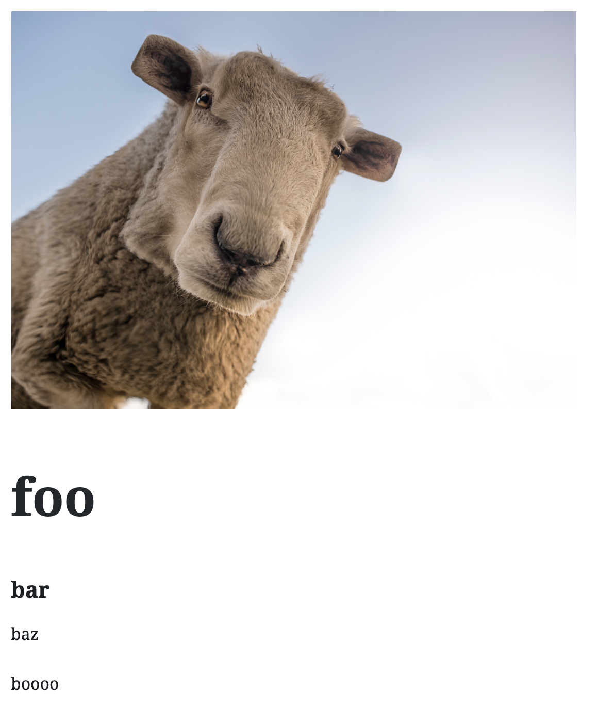

# Image and text block

This block combines Image with texts (title, subtitle, highlight and content) as a small card.



## Installation

1. Copy `imageandtext.php` inside `your_wordless_theme/config/initializers/blocks/`

2. Insert this line
   ```
     new Imageandtext();
   ```
   inside `create_blocks()` function in `your_wordless_theme/config/initializers/custom_gutenberg_acf_blocks.php`


3. Copy `_imageandtext.sass` inside `your_wordless_theme/theme/assets/stylesheets/blocks/`

4. Include it adding `@import 'blocks/imageandtext'` inside `your_wordless_theme/theme/assets/stylesheets/blocks.sass`

5. Copy `_imageandtext.pug` file must be copied inside `your_wordless_theme/theme/views/blocks/`
